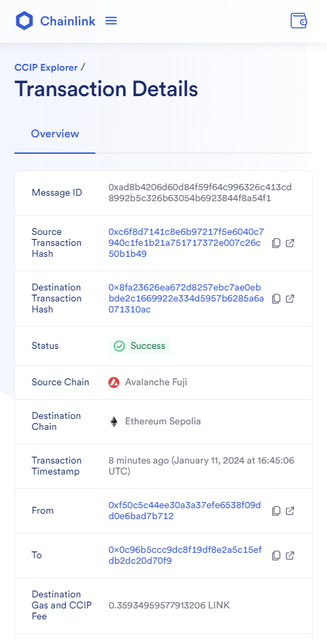
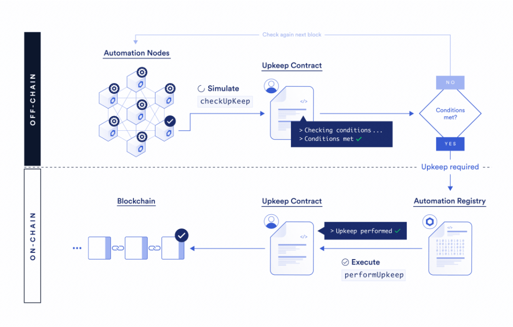

# Chainlink Bootcamp EN 2024

[Slides](https://docs.google.com/presentation/d/e/2PACX-1vRQ5ssT21p2lr6vFgxD5_JUp3ZXePsjxVsi56ljD_UUbT2b5COSXXhDE0CsBjMBRPkVH9yofNUsvz-X/pub?start=false&loop=false&delayms=3000)

## Day 1
**[Fundamental Blockchain Concepts and Wallets](https://www.youtube.com/watch?v=G7V-G7RURDI)**

- Creating wallets in MetaMask, Account1 and Account2
- Get Sepolia ETH from faucet for Account1
- Transfer from Account1 to Account2 0.1 Sepolia ETH

## Day 2
**[Solidity Fundamentals](https://www.youtube.com/watch?v=c5YwxmuWIcw)**

### Creation of the Register.sol smart contract
This contract is very basic that allows obtaining and establishing a single chain of information.

### Creating the RegisterAccess.sol smart contract

This contract is a simple access control system that allows the owner to manage a list of information, control access to certain functions, and monitor changes through events.

## Day 3
**[Oracles, ERC20 Tokens, and Chainlink Data Feeds](https://www.youtube.com/watch?v=E1sBc1YFgus)**

### Creation of the Token.sol smart contract

This contract creates the token. Extends the OpenZeppelin ERC20 and AccessControl contracts. 

This token contract introduces a role-based access control mechanism, allowing certain addresses with MINTER_ROLE to create (mint) new tokens. 

Total supply, balances and token transfers follow standard ERC-20 behavior inherited from the OpenZeppelin ERC20 contract.

### Creation of the TokenShop.sol smart contract

This is where the token created comes from — itats a simple dApp (decentralized application) that acts as a token store, allowing users to purchase tokens by sending ETH to the contract. 

This contract relies on an external Chainlink oracle to obtain the ETH/USD price.


## Day 4

**[Cross-Chain Tokens Using Chainlink CCIP](https://www.youtube.com/live/5IFeP0gdcpM?si=MriUBCNBkFYNvoyv)**

Creation of the CCIPTokenSenderFujiSepolia.sol smart contract

Here we use Cross Chain Interoperability Protocol to transfer Chainlink CCIP messages from the AVAX Fuji testnet to the Sepolia Ethereum testnet. 

It involves building and sending a CCIP message, managing fees on LINK tokens, and allowing the contract owner to withdraw the remaining tokens. 

The destination chain selector (destinationChainSelector) is set on the Sepolia testnet.


**[Chainlink CCIP](https://docs.chain.link/ccip)**

**[Testnet AVAX Fuji](https://testnet.snowtrace.io/)**

**[CCIP supported networks](https://docs.chain.link/ccip/supported-networks)**



## Day 5
**[Mentoring Session With the Chainlink Community](https://www.youtube.com/live/xSfTQ66qUm0?si=XjficlYLr2gRYCIm)**

Call section with some members of the Chainlink global community.

## Day 6 

**[NFTs and Chainlink Automation](https://www.youtube.com/watch?v=WjBmwy5NDgU)**

NFTs (Non-Fungible Token) represent something
- Unique ID and Auto-increment

Images in NFTs

IPFS: Piñata, Infura, Quicknode NFT.storage, Web3.storage, Thirdweb storage

Metadata - Json
```
{
    "name": "NFT item name",
    "description": "NFT item description",
    "image": "https://...",
    "attributes": [...]
}
```

Creating a NTF collection with OpenZeppelin wizard
https://wizard.openzeppelin.com/#erc721

Listing in OpenSea marketplace
https://testnets.opensea.io/

Creating Dynamic NFT

Metadata - On-chain upgrade
    - Metadata URL
    - URL image
    - Json

- Smart contracts are NOT self-executing
- They cannot alone start a process or call its functions from time to time or under certain conditions
- Changes in the state of a smart contract only happen when a transaction is initiated by another account
- Examples: a user, oracle or other smart contract

Updating NTFs with Blockchain Oracles

Chainlink Automation: Decentralized smart contract automation

Decentralized netwowk of nodes. Which are rewarded for running registered processes (jobs), called Upkeeps.

They can be used to verify conditions and send transactions to smart contracts according to pre-established reules. It is the active agent that will interact with a smart contract.



[Chainlink Automation](https://chain.link/automation)

[Docs Chainlink Automation](https://docs.chain.link/chainlink-automation)

[Register new Upkeep](https://automation.chain.link/)


## Day 7

**[Cross-chain NFTs Chainlink CCIP (Messages)](https://www.youtube.com/watch?v=XjzJtD2ySQ0)**

Arbitrary Messaging

Programmable Token Transfers

Cross-chain NFTs

[Price Feed Contract Addresses](https://docs.chain.link/data-feeds/price-feeds/addresses)

## Day 8

**[Generating Random Numbers Using Chainlink VRF](https://www.youtube.com/watch?v=-tBZsxsE8K0)

**Chainlink VRF (Verifiable Random Function)** is a provably fair and verifiable random number generator (RNG) that enables smart contracts to access random values without compromising security or usability.

**[VRF Resource](https://dev.chain.link/products/vrf)**

## Day 9

**[Access Offchain Data With Chainlink Functions](https://www.youtube.com/watch?v=jK6NMxz3wvc)**

Chainlink Functions allows anyone to write serverless code to fetch any data from any API and run custom compute on Chainlink's network.

**[usechainlinkfunctions.com](https://usechainlinkfunctions.com/)**

**[Docs Chainlink Functions](https://dev.chain.link/products/functions)**

**[Ways To Use Chainlink Functions in Your Decentralized Applications](https://blog.chain.link/ways-to-use-chainlink-functions/)**

